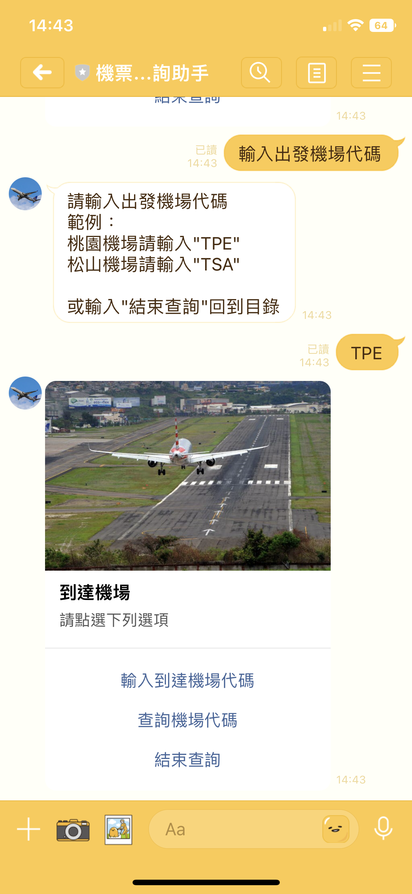
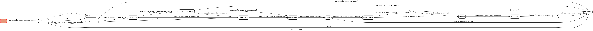

# ToC Project 2022 - 機票價格查詢助手

## 發想
距離疫情開始已經快要經過三年，你還記得自己上次出國是什麼時候嗎？  
近期終於迎來國門開放，也在社群上看到不少人早就在國外拍照打卡，  
然而，我們還深陷期末考的水深火熱之中，出國最快也得等到寒假了QQ，  
為了之後在規畫行程時省去一些麻煩，因此我製作了這個機票價格查詢助手。

## 環境
Ubuntu 20.04  
Python 3.8.10  

## 介紹
### line bot 資訊
名稱：機票價格查詢助手  
ID：@813ntfsr  
可輸入ID（@也要輸入）或直接掃描QR code加入好友  

### 功能
依照指示輸入如出發地與目的地，日期與人數等訂票所需資訊，  
機器人就會幫助搜尋最優（價格與時間綜合考慮）結果與其價格，  
並提供訂票網址。
### 使用實例
首先輸入「開始」，進到主目錄  
  
點選「使用說明」可參考小助手的使用步驟  
  
點選「查詢機票價格」可開始輸入訂票資料 
  
  
在「出發機場目錄」與「到達機場目錄」皆可查詢機場代碼
  
輸入去程時間後可選擇是否需要訂購回程(輸入回程時間)  
  
輸入人數與選擇艙等  
  
得到結果  
  

## FSM圖
 

## 參考網站
1. 機票搜尋：[Skyscanner](https://www.skyscanner.com.tw)  
2. 機場代碼列表：[飛斯特運通股份有限公司](http://www.exbtr.com/TW/Page.aspx?tn=ca12_1_1_6&Tid=4)
